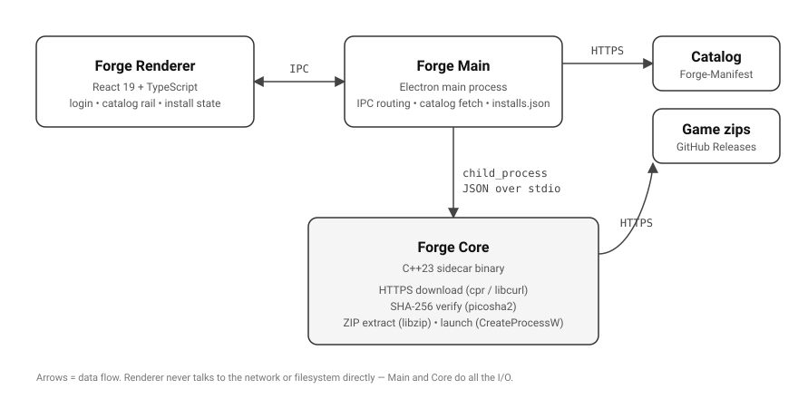

# Forge

A desktop game launcher with an Electron UI on top of a native C++ core. Download a game from a remote catalog, verify it by SHA-256, extract it, launch it. Targeted at Windows for v0.1.


---

## What it is

A portfolio implementation of the "boring" parts of a real game launcher, written end-to-end:

- A React/TypeScript UI in Electron handles login, catalog browsing, install state, and the launch button.
- A C++23 sidecar process (`forge_core.exe`) does the actual work: HTTPS download, streaming SHA-256 verification, ZIP extraction (with zip-slip protection), child-process supervision.
- The two halves talk over JSON-over-stdio, with a request/response envelope and mid-stream progress events.
- The catalog itself lives in a [separate GitHub repo](https://github.com/Major-Lag98/Forge-Manifest) — adding a game means committing one file to that repo, no client release.

The goal was to demonstrate the listed qualifications for a publishing-platform / launcher role end-to-end (C++ application development, Electron, desktop apps, build pipelines, automated testing). See [project-state.md](./project-state.md) for the canonical scope, design decisions, and what was explicitly cut.

---

## Try it

1. Grab the latest `forge-*-setup.exe` from the [Releases page](https://github.com/Major-Lag98/Forge/releases) and run it.
2. Windows SmartScreen will warn you: _"Microsoft Defender SmartScreen prevented an unrecognized app from starting."_ Click **More info → Run anyway**. The installer isn't code-signed — production launchers buy an EV certificate (~$300–700/year) for instant SmartScreen trust; for a portfolio project that's not a cost worth paying. The binary is built by the [Release workflow](./.github/workflows/release.yml) on a Windows GitHub runner, the SHA-256 is on the release page, and the source is right here.
3. Forge installs into `%LOCALAPPDATA%\Programs\Forge`. Launch it from the Start Menu shortcut or the desktop shortcut the installer adds.
4. Log in with any username (auth is stubbed in v0.1). The catalog rail loads from the remote manifest; click a tile to see install / launch / uninstall actions.

Games install into `%APPDATA%\Forge\installs\<game-id>\` and persist across launches.

---

## Tech stack

| Layer          | Choice                                                                                                                                        |
| -------------- | --------------------------------------------------------------------------------------------------------------------------------------------- |
| UI             | React 19 + TypeScript, bundled by [electron-vite](https://electron-vite.org)                                                                  |
| Shell          | Electron                                                                                                                                      |
| Native sidecar | C++23 (CMake + [vcpkg](https://vcpkg.io) in manifest mode)                                                                                    |
| HTTP           | [`cpr`](https://github.com/libcpr/cpr) (libcurl wrapper)                                                                                      |
| Hashing        | [picosha2](https://github.com/okdshin/PicoSHA2) — header-only streaming SHA-256                                                               |
| Archives       | [libzip](https://libzip.org)                                                                                                                  |
| IPC            | line-delimited JSON over `stdin`/`stdout`, with `{id, result\|error}` envelopes and mid-stream `{id, event: "progress", percent}` messages    |
| Tests (C++)    | GoogleTest (unit) + [cpp-httplib](https://github.com/yhirose/cpp-httplib) for an in-process HTTP mock                                         |
| Tests (JS/TS)  | [Vitest](https://vitest.dev) + [React Testing Library](https://testing-library.com/react) + jsdom                                             |
| Packaging      | [electron-builder](https://www.electron.build) (NSIS installer)                                                                               |
| CI/CD          | GitHub Actions on `windows-latest`, separate `ninja` (Debug) preset for the main branch test workflow and `ninja-release` for tagged releases |

---

## Architecture



The renderer never talks to the network or the filesystem directly. The main process fetches the catalog over HTTPS at startup (and on refresh), forwards install/launch/uninstall requests to the C++ core over the IPC bridge, and persists install records to `%APPDATA%\Forge\installs.json`. The C++ core has no opinion about UI; it could be driven by anything that speaks the JSON protocol.

See [project-state.md §5](./project-state.md#5-architecture-current-plan) for the wider design history.

---

## Building from source

### Prerequisites

- **Windows 10/11**, x64.
- **Node 22+** (`winget install OpenJS.NodeJS.LTS`).
- **Visual Studio 2022** with the _Desktop development with C++_ workload (or VS Build Tools 2022 with the equivalent components). The default CMake preset uses the `Visual Studio 17 2022` generator.
- **CMake 3.25+** (`winget install Kitware.CMake`).
- **Git** with submodule support — vcpkg is included as a submodule.

### One-time setup

```powershell
git clone https://github.com/Major-Lag98/Forge.git
cd Forge
git submodule update --init --recursive
.\vcpkg\bootstrap-vcpkg.bat -disableMetrics
npm ci
```

### Run in dev mode

```powershell
# Build the C++ core (first time + after C++ changes)
npm run test:cpp

# Launch the Electron app with hot reload
npm run dev
```

`npm run dev` spawns `forge_core.exe` from `core/build/default/core/Debug/`. To point at a different binary (e.g. a Release build), set `FORGE_CORE_PATH`. To override the remote catalog URL for offline dev or testing, set `FORGE_CATALOG_URL` (e.g. to a `file://` path or a local HTTP server).

### Build a Windows installer

```powershell
npm run build:win
```

Produces `dist/forge-0.1.1-setup.exe`. Local installer builds require Windows Developer Mode enabled (Settings → Privacy & security → For developers) so electron-builder can extract the `winCodeSign` cache. Tagged commits build the installer in CI without this requirement; see [`.github/workflows/release.yml`](./.github/workflows/release.yml).

### Tests

```powershell
npm test          # ctest + vitest
npm run test:cpp  # ctest only (forge_core unit + integration tests via GoogleTest)
npm run test:js   # vitest only (main-process + renderer)
```

CI runs both on every push to `main` and on every PR.

---

## Project status & scope

- v0.1 = working Windows demo (download, verify, extract, launch).
- Out of scope: differential patching, resumable downloads, OS keychain auth, code signing, cross-platform, telemetry, DRM. See [project-state.md §3](./project-state.md#3-non-goals-explicit) for the full non-goals list and the reasoning.
- Current phase + remaining checkboxes live in [project-state.md §6](./project-state.md#6-pending-tasks).
